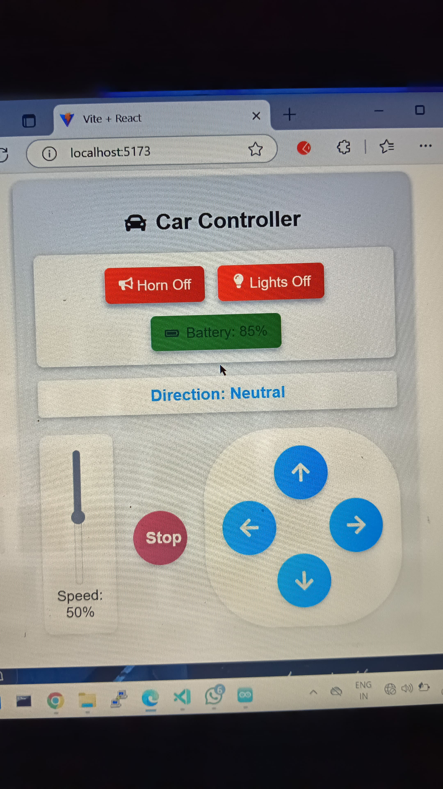

# ESP32 RC Car Control: A ReactJS-Based WebSocket Client

This project is a simple ReactJS-based WebSocket client designed to control an ESP32-powered RC car. It provides a basic user interface to send commands to the car via WebSocket communication.

## Features
- Real-time control of the RC car using WebSocket.
- Basic UI for sending commands (e.g., forward, backward, left, right).
- Lightweight and easy to integrate with ESP32 firmware.

## Basic UI

Below is a screenshot of the basic user interface:

## How It Works
1. The ReactJS app establishes a WebSocket connection with the ESP32.
2. The UI provides buttons or controls to send specific commands (e.g., move forward, turn left).
3. The ESP32 receives the commands via WebSocket and controls the motors accordingly.

## Setup Instructions
1. Clone the repository.
2. Install dependencies using `npm install`.
3. Start the development server with `npm run dev`.
4. Ensure the ESP32 is running the corresponding WebSocket server firmware.
5. Connect to the ESP32's WebSocket server from the React app.

## Dependencies
- ReactJS
- WebSocket API
- ESP32 firmware (custom implementation for RC car control)

## Future Improvements
- Add a live video stream from the car's camera.
- Implement a virtual joystick for smoother control.
- Enhance the UI with better styling and responsiveness.

## License
This project is open-source and available under the [MIT License](./License).
